# Управление товарами в каталоге #

Администратор может создавать, редактировать, удалять товары в каталоге, изменять их активность (то есть будут они отображаться на сайте или нет).

## Создание товара в каталоге ##

Для того, чтобы создать в каталоге товар, в административной части необходимо перейти в раздел "Каталог".

Новый товар можно создать вручную, кликнув на кнопку "Создать" (п.1 на скриншоте), а также воспользоваться функцией загрузки из CSV- и XML-файлов (п.2 и 3 на скриншоте)

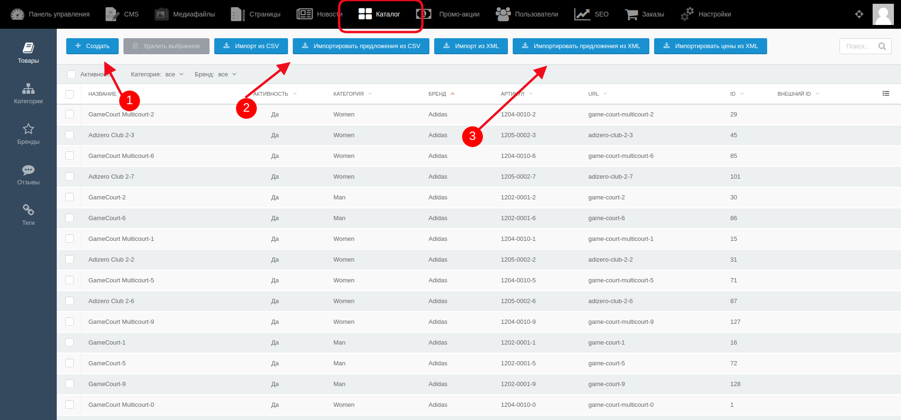
  

### Создание товара вручную ###

Для того, чтобы создать товар вручную (используется при незначительном количестве товаров), необходимо кликнуть по кнопке "Создать", после чего откроется страница создания нового объекта.

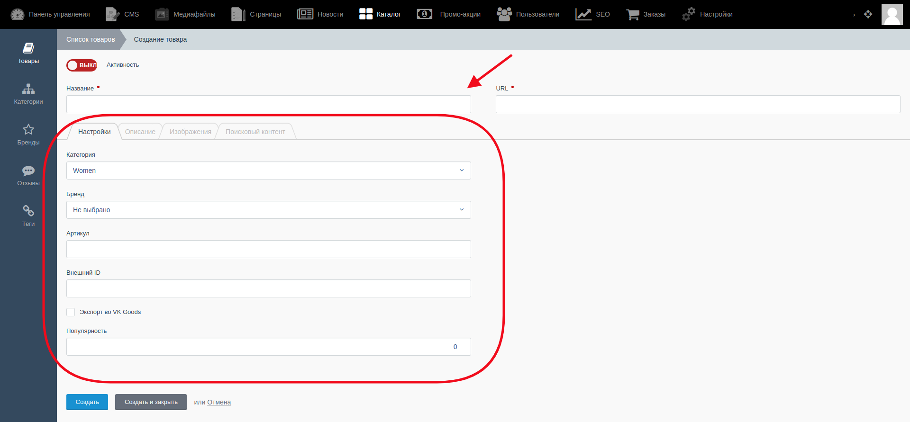

Изначально открывается **вкладка "Настройки"**, где администратор заполняет необходимые поля информацией о товаре.

- Настройки отображения товара регулируются переключателем "Активность" - Вкл/Выкл.

- В поле "Название" администратор заполняет название товара, это же название дублируется на латинице в поле URL.

- В полях "Категория" и "Бренд" администратор выбирает категорию товара и его бренд из выпадающего списка.

- Поля "Артикул", "Внешний ID" и "Популярность" заполняются вручную.

- Также есть чек-бокс "Экспорт в VK Goods", и администратор может поставить галочку для эскпорта этого товара во VK Goods. 

**Вкладка "Описание"**

Эта вкладка имеет два поля, в которые вноситcя информация о товаре: поле "Краткое описание" и поле "Описание", где идёт более подробное описание товара.

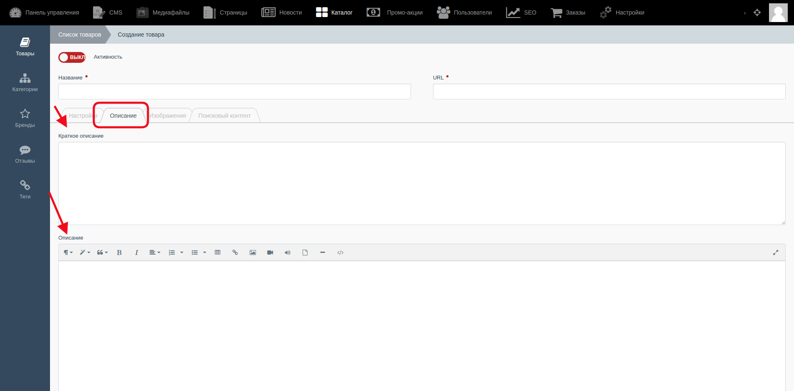

На сайте для пользователя это будет выглядеть вот так: п.1 на скриншоте - то, как выглядит краткое описание товара, п.2 - полное описание.

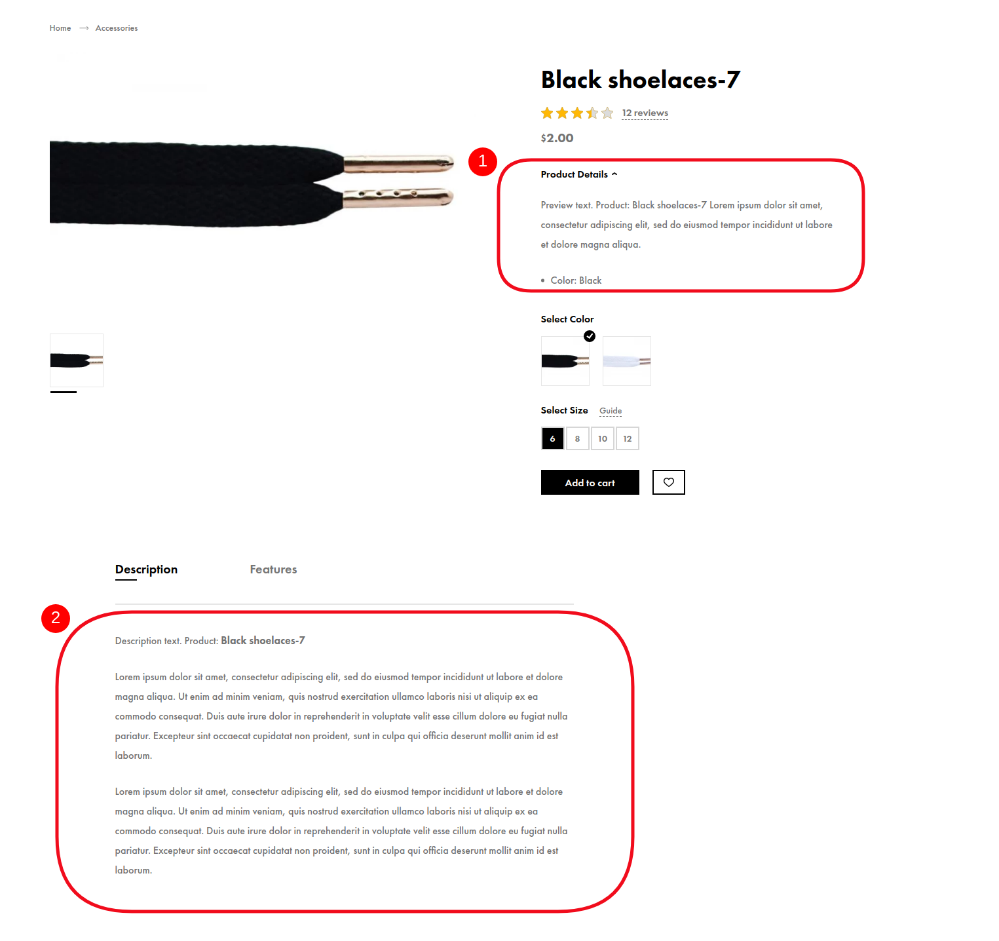

**Вкладка "Изображения"**

В этой вкладке можно прикрепить изображения для превью товара (п.1 на скриншоте) и изображения для отображения в галерее товара (п.2)

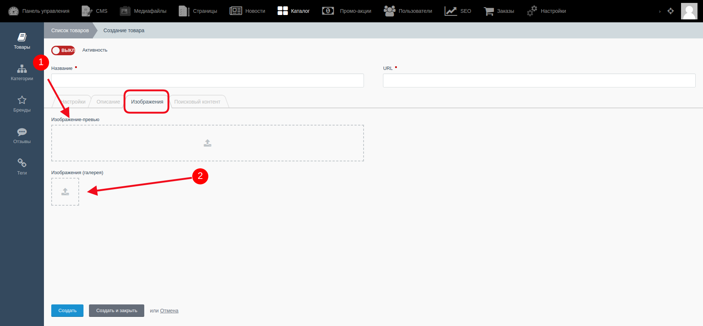

На сайте превью товара будет выглядеть так:

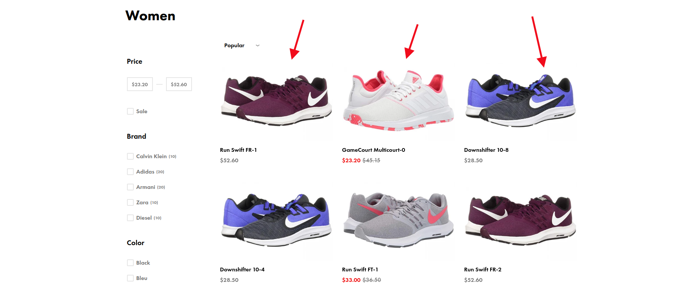

Галерея изображений товара выглядит следующим образом:

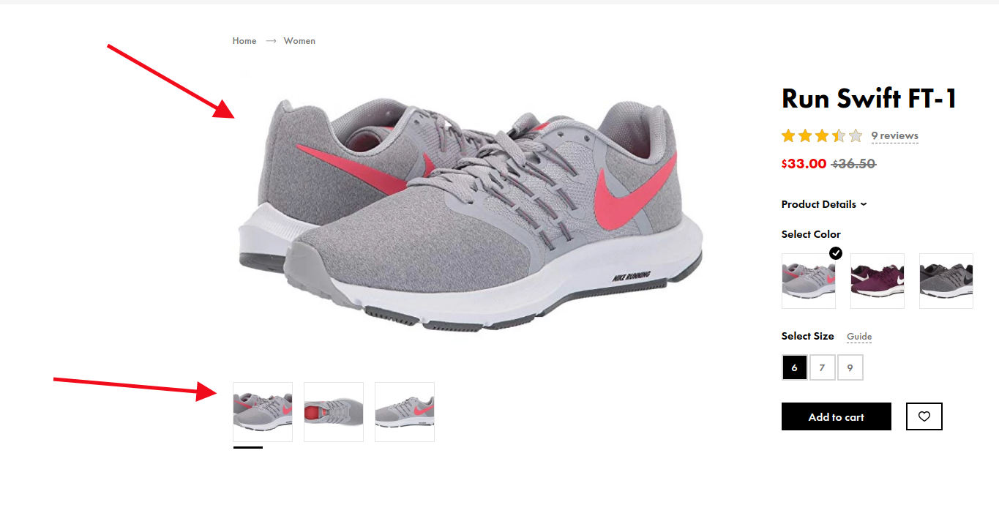

**Вкладка "Поисковый контент"**

В этой вкладке вносится информация, необходимая для SEO-продвижения.

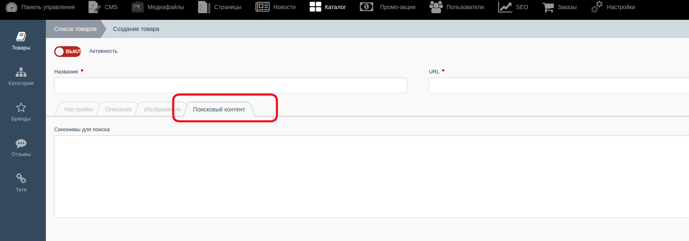

### Создание товаров с помощью импорта из XML- и CSV-файлов ###

Добавление товаров в каталог, обновление информации о них при изменении их цен, наличия или изменения с помощью импорта CVS- или XML-файлов позволяет сократить время, которое необходимо для поддержания каталога в актуальном состоянии.

Для этого необходимо иметь уже готовые прайс-листы в одном из указанных форматов (CVS или XML). Затем необходимо выбрать один из способов загрузки:

* Импорт из CSV
* Ипортировать предложения из CSV
* Импорт из XML
* Импортировать предложения из XML
* Импортировать цены из XML

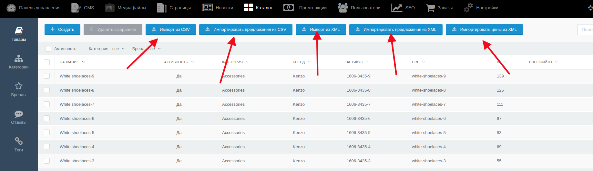

##### Импорт из CSV ##### 

После выбора одного из способов загрузки открывается следующая страница:

Сначала надо выбрать файл на локальном компьютере (п.1 на скриншоте), затем, если необходимо, выбрать формат файла - стандартный или пользовательский (п.2). 

Далее, после загрузки файла, существует опция применения столбцов файла к полям базы данных. Можно выбрать автоприменение столбцов, также можно просмотреть пропущенные столбцы (п.3)

Следующий шаг - п.4 на скриншоте - выбор параметров ипорта - все товары, находящиеся в загружаемом файле можно загрузить в VK Goods, а также деактивировать те элементы, которых нет в CSV-файле.

После всех настроек нужно нажать кнопку "Импортировать записи"

##### Импорт из XML #####

При нажатии на одну из кнопок, связанных с импортом из XML, появляется pop up для подтверждения действия. 

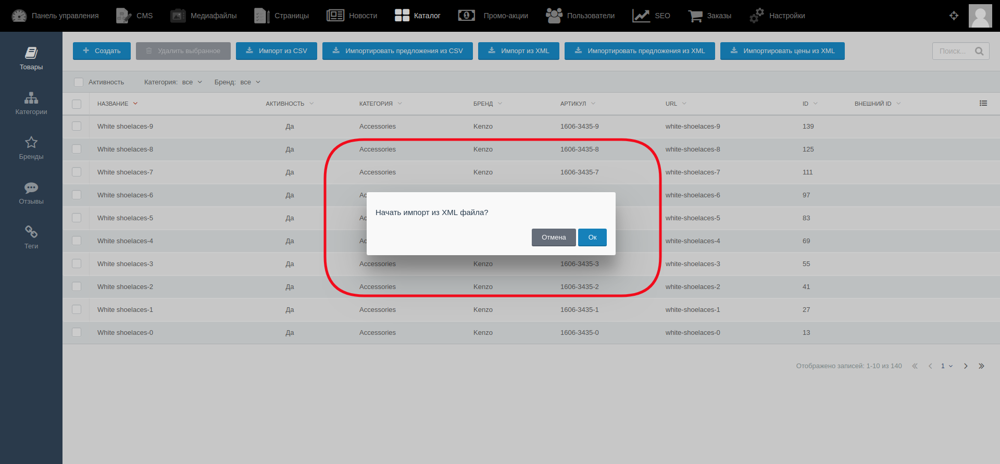

## Редактирование или удаление товара в каталоге ##

Для **редактирования** товара в списке товаров надо выбрать один, кликнуть на него, и в открывшейся странице произвести необходимые изменения.

После редактирования необходимо сохранить изменения.

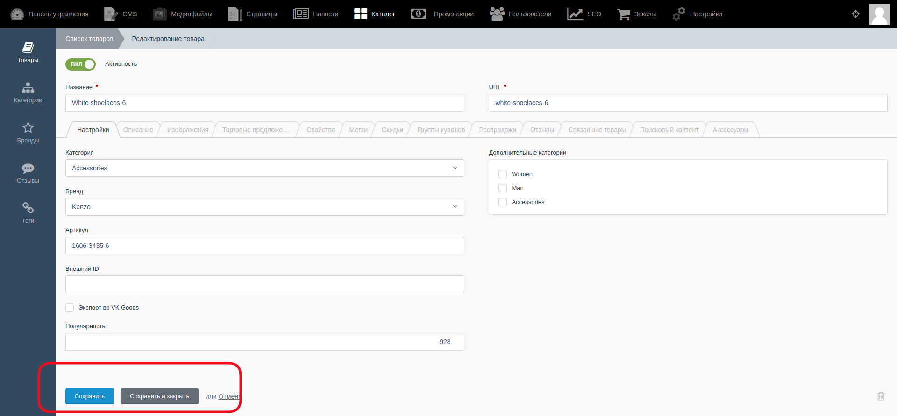

Следует знать, что количество вкладок на странице товара будет различаться в зависимости от того, к каким дополнительным опциям товар привязан (промо-акции, торговые предложения и т.д), например:

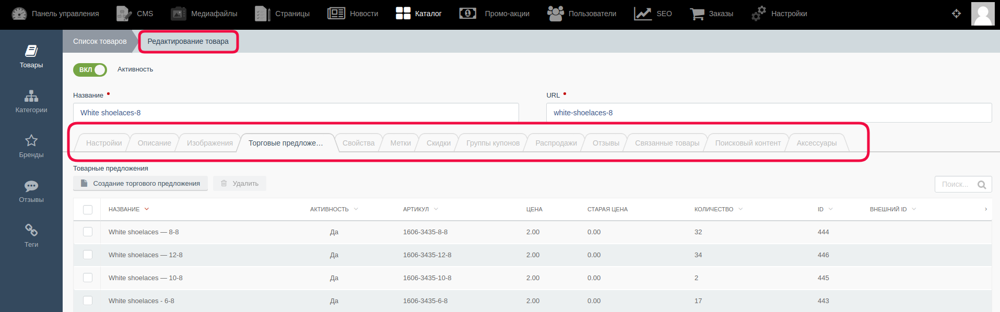

Для **удаления** товара в списке ранее добавленных товаров с помощью чек-бокса надо выделить один или несколько товаров, которые надо удалить. После появления pop up "Удалить выбранные записи?" для удаления нажать "OK", для отмены - "Отмена"  

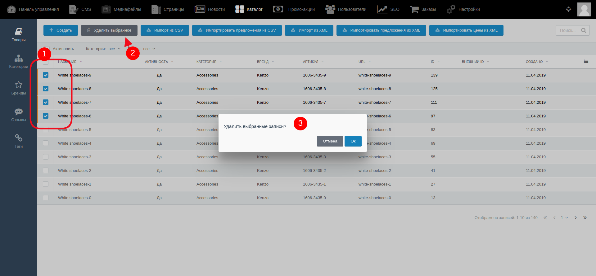

#### **Важно!** После внесения каких-либо изменений их надо сохранить с помощью кнопок:

* Кнопка “Сохранить” - используется после завершения заполнения необходимых полей для сохранения информации и корректном её отображении на сайте. После её нажатия происходит обновление информации, а администратор остается на странице редактирования.

* Кнопка “Сохранить и закрыть” - используется после завершения заполнения необходимых полей для сохранения информации и корректном её отображении на сайте. После её нажатия происходит обновление информации, а администратор автоматически переходит к списку, открывающемуся по умолчанию. 
