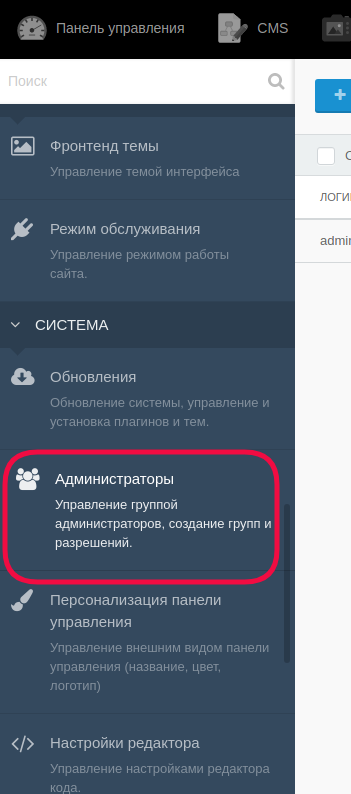
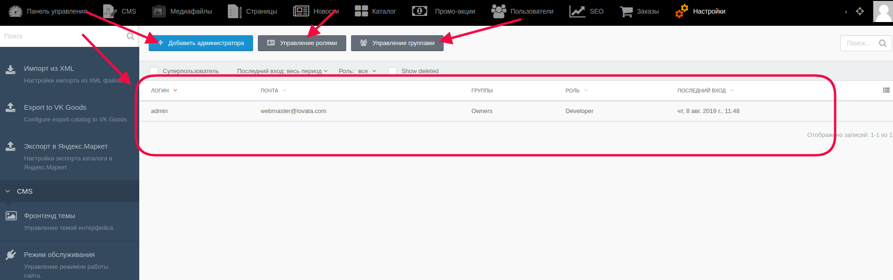
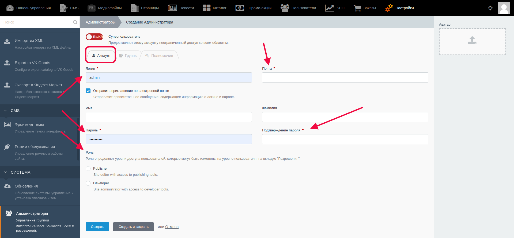
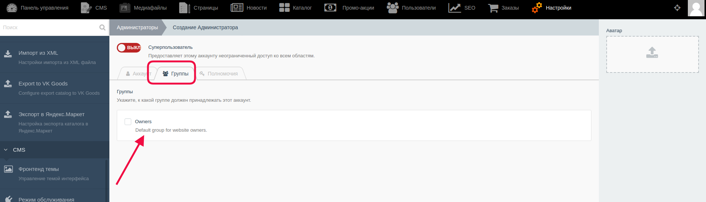
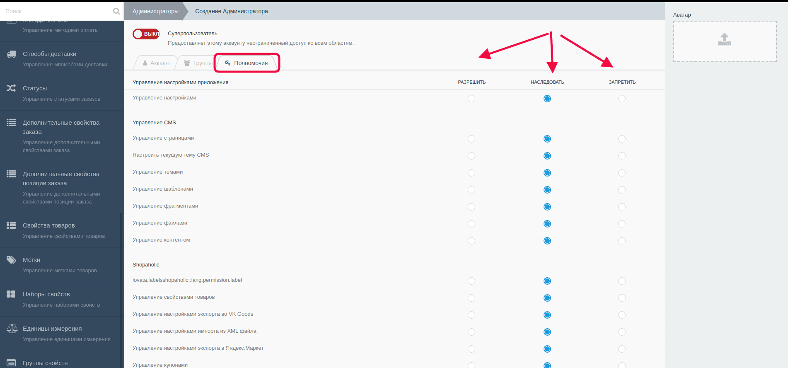
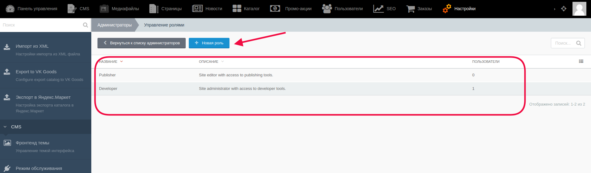
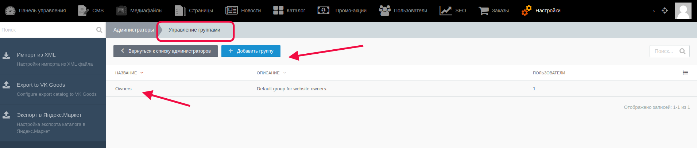

# Работа с группой "Администраторы"

В верхнем меню выбрать “Настройки” 

В меню слева просколлить вниз и выбрать в разделе “Система” пункт “Администраторы”.

На открывшейся странице администратор может видеть список уже созданных пользователей, узнать, к каким группам они принадлежат, изменять права доступа для пользователей из разных групп и т.д.

На скриншоте обозначены:

- Кнопка, с помощью которой администратор может добавить другого администратора.

- Кнопка, с помощью которой происходит управление ролями пользователей.

- Кнопка, с помощью которой можно просматривать/редактировать группы пользователей.

- Список уже созданных пользователей с содержащейся информацией о них.

#### Добавление администратора

С помощью этой кнопки администратор может добавить нового пользователя и наделить его определенными правами.

На вкладке “Аккаунт” задаются основные параметры пользователя: его логин, пароль, email, роль, аватар.

На вкладке “Группы” можно добавить администратора к одной из ранее созданных групп.

На вкладке “Полномочия” администратор определяет полноту доступа и управления для другого администратора (“Разрешить”, “Наследовать”, “Запретить”)

С помощью переключателя "Суперпользователь" администратор включает/выключает режим суперпользователя для неограниченного доступа этого администратора ко всем областям.

#### Управление ролями пользователей

Здесь администратор может просмотреть роли ранее созданные, редактировать их, а также удалять.

Для перехода к редактированию/удалению ранее созданной роли надо кликнуть на неё в общем списке.

Для создания новой надо кликнуть на кнопку “Новая роль”.

#### Управление группами

На этой странице администратор может добавлять новые группы пользователей, а также редактировать и удалять уже существующие (для просмотра/редактирования/удаления надо кликнуть на название группы - откроется страница с информацией об этой группе)

#### **Важно!** После внесения каких-либо изменений их надо сохранить с помощью кнопок:

* Кнопка “Сохранить” - используется после завершения заполнения необходимых полей для сохранения информации и корректном её отображении на сайте. После её нажатия происходит обновление информации, а администратор остается на странице редактирования.

* Кнопка “Сохранить и закрыть” - используется после завершения заполнения необходимых полей для сохранения информации и корректном её отображении на сайте. После её нажатия происходит обновление информации, а администратор автоматически переходит к списку, открывающемуся по умолчанию.