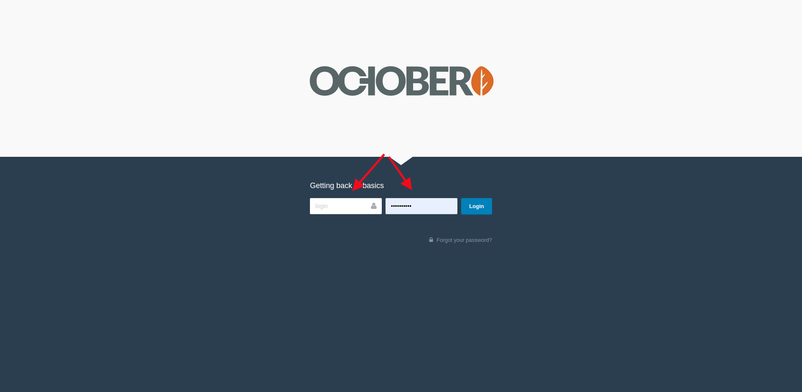
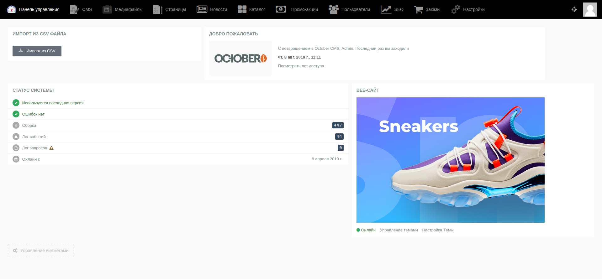
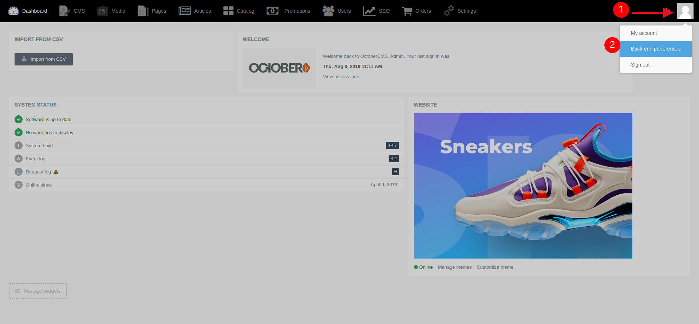
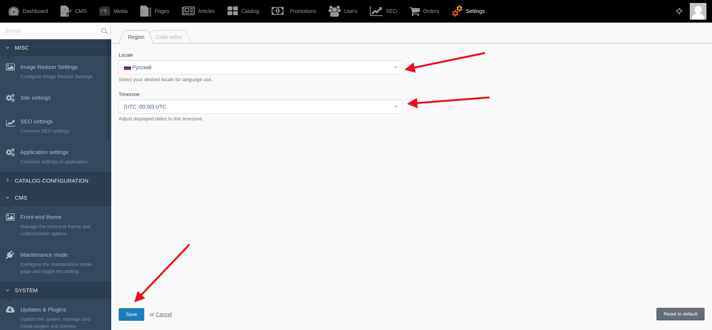
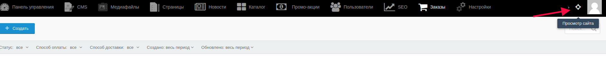

# Вход в административную часть сайта

Для создания/редактирования/удаления информации следует войти в административную часть сайта.

Для этого необходимо ввести в адресной строке браузера название сайта/backend и перейти по данному адресу.

Чтобы получить права администратора, надо ввести свой логин и пароль в соответствующие поля на открышейся странице, затем нажать кнопку “Вход” или кнопку Enter на клавиатуре.

При успешной авторизации пользователь попадает в административную часть сайта.

Чтобы выбрать необходимый язык, на котором будет отображаться система, необходимо кликнуть на аватар администратора в правом верхнем углу (п.1 на скриншоте), затем выбрать из открывшегося списка **Back-end preferences/Настройки** панели управления (п.2 на скриншоте)

Затем, во вкладке **Local/Регион** выбрать из списка нужный язык, после сохранить изменения. Также здесь можно выбрать часовой пояс.

Основные настройки завершены.

Также есть возможность просмотра сайта кака посетитель. Для этого, находясь в административной части сайта, надо кликнуть на иконку "Просмотр сайта"

#### **Важно!** После внесения каких-либо изменений их надо сохранить с помощью кнопок:

* Кнопка “Сохранить” - используется после завершения заполнения необходимых полей для сохранения информации и корректном её отображении на сайте. После её нажатия происходит обновление информации, а администратор остается на странице редактирования.

* Кнопка “Сохранить и закрыть” - используется после завершения заполнения необходимых полей для сохранения информации и корректном её отображении на сайте. После её нажатия происходит обновление информации, а администратор автоматически переходит к списку, открывающемуся по умолчанию.