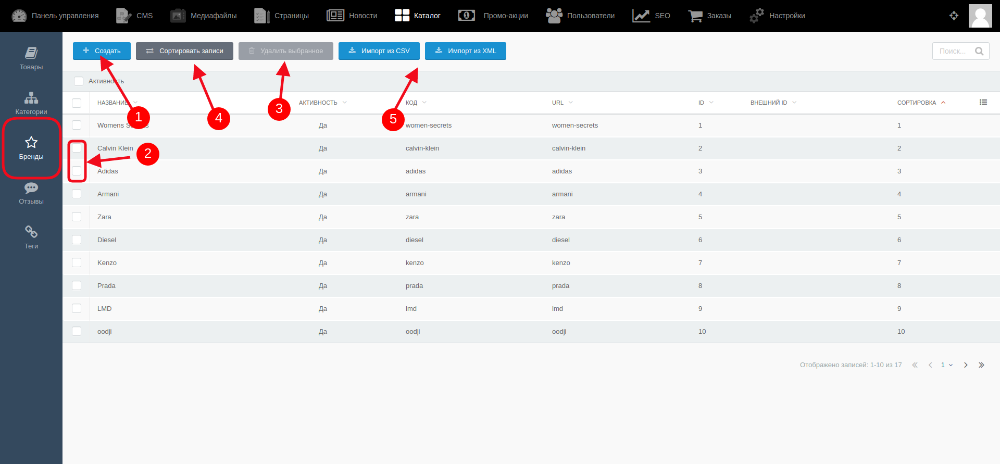
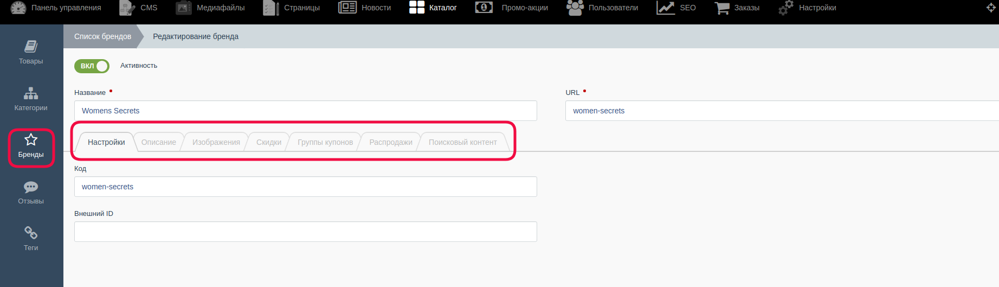
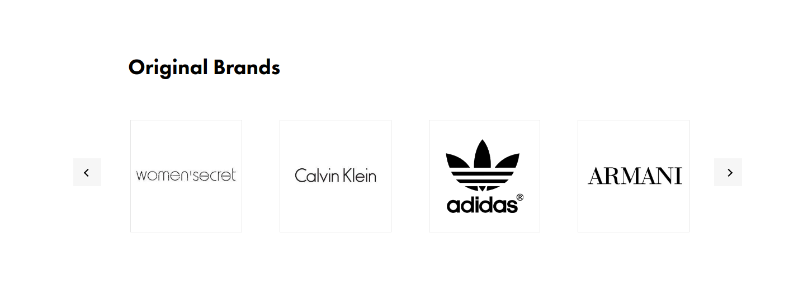

# Управление брендами #

Для перехода к этой группе необходимо в верхнем меню выбрать “Каталог”, затем, после открытия страницы с настройками каталога, в левом меню выбрать группу “Бренды”.

- Для создания бренда в списке надо кликнуть на “Создать” (п.1 на скриншоте) На открывшейся новой странице администратор заполняет поля во вкладках информацией, а после сохраняет изменения. 

- Для того, чтобы удалить один или несколько брендов, надо отметить при помощи чек-боксов эти бренды (п.2 на скриншоте), затем нажать кнопку “Удалить выбранное” (п.3 на скриншоте)

- Для изменения порядка отображения брендов на сайте надо нажать на кнопку “Сортировать записи(п.4 на скриншоте), и в открывшейся новой странице навести и зажать курсором тот бренд, который надо переместить.

- Для редактирования бренда надо кликнуть по его названию.

- Для удаления одного или нескольких брендов надо выделить их в списке с помощью чек-боксов, затем нажать кнопку "Удалить выбранное", а далее подтвердить своё действие

- Для загрузки брендов из CSV-или XML-файлов надо кликнуть на кнопку "Импорт из CSV/XML" (п.5 на скриншоте)

На странице бренда количество вкладок (кроме основных) будет изменяться в зависимости от того, к каким дополнительным опциям будет привязан бренд:

Для пользователя на сайте блок брендов выглядит так: 

#### **Важно!** После внесения каких-либо изменений их надо сохранить с помощью кнопок:

* Кнопка “Сохранить” - используется после завершения заполнения необходимых полей для сохранения информации и корректном её отображении на сайте. После её нажатия происходит обновление информации, а администратор остается на странице редактирования.

* Кнопка “Сохранить и закрыть” - используется после завершения заполнения необходимых полей для сохранения информации и корректном её отображении на сайте. После её нажатия происходит обновление информации, а администратор автоматически переходит к списку, открывающемуся по умолчанию.