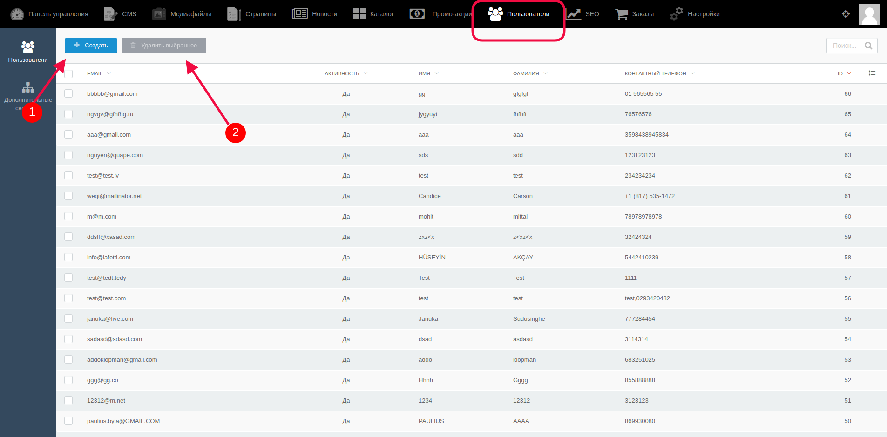
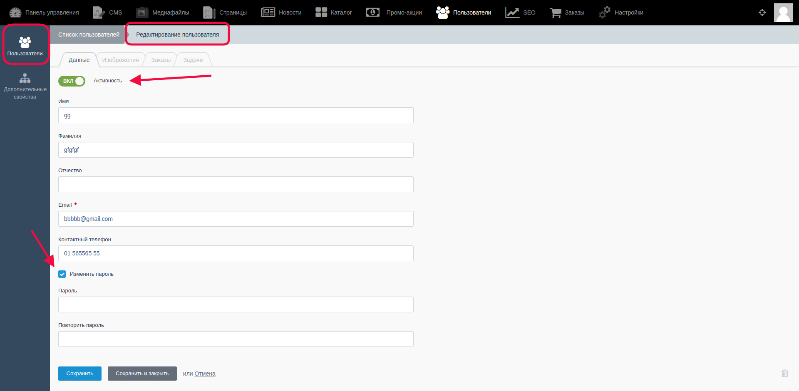

# Управление информацией о покупателях #

В административной части магазина возможен просмотр, редактирование и удаление пользователей.

Для просмотра списка покупателей и осуществления различных операций над их профилями необходимо находясь в административной части сайта, перейти в раздел "Пользователи". 

Открывается список всех ранее оформленных покупателей (пользователей, осуществивших какие-либо покупки в магазине и заполнивших информацию о себе.)

С помощью кнопки "Создать" администратор может создать нового пользователя (п.1 на скриншоте), удалить одного пользователя или несколько можно предварительно отметив их с помощью чек-боксов слева от списка, а затем нажать кнопку "Удалить выбранное" (п.2 на скриншоте) и подтвердить своё действие. Для редактирования профиля пользователя надо кликнуть в списке на строку с его Email и внести изменения на открывшейся странице.

Все данные о пользователе и его действиях содержатся во вкладках:

**Вкладка "Данные"**:

- Активность пользователя включается или выключается переключателем "Вкл/Выкл".

- В полях "Имя", "Фамилия", "Отчество", "Email", "Контактный телефон" можно изменить контактные данные пользователя.

- Если поставить галочку в чек-боксе "Изменить пароль", то администратор может изменить пароль пользователя.

**Вкладка "Изображения"** содержит загруженные изображения или же здесь можно загрузить новое изображение или удалить старое.

**Вкладка "Заказы"** содержит все совершенные заказы этого пользователя. При клике на сам заказ администратор переходит к подробной информации об этом заказе, и, при необходимости, может её изменять.

**Вкладка "Задачи"** позволяет просмотреть все уведомления, которые были созданы для пользователя или отправлены ему. Также здесь можно создать новое уведомление для пользователя.

#### **Важно!** После внесения каких-либо изменений их надо сохранить с помощью кнопок:

* Кнопка “Сохранить” - используется после завершения заполнения необходимых полей для сохранения информации и корректном её отображении на сайте. После её нажатия происходит обновление информации, а администратор остается на странице редактирования.

* Кнопка “Сохранить и закрыть” - используется после завершения заполнения необходимых полей для сохранения информации и корректном её отображении на сайте. После её нажатия происходит обновление информации, а администратор автоматически переходит к списку, открывающемуся по умолчанию.