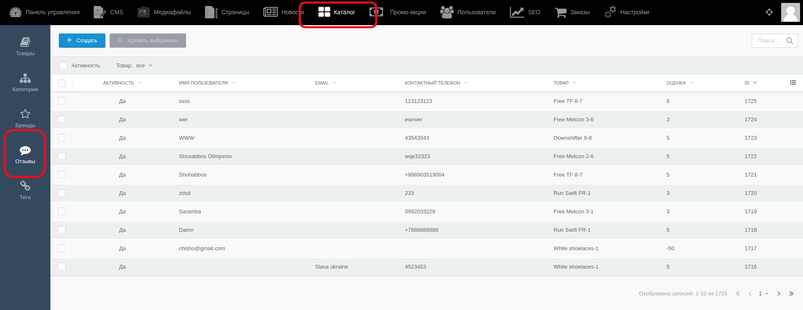
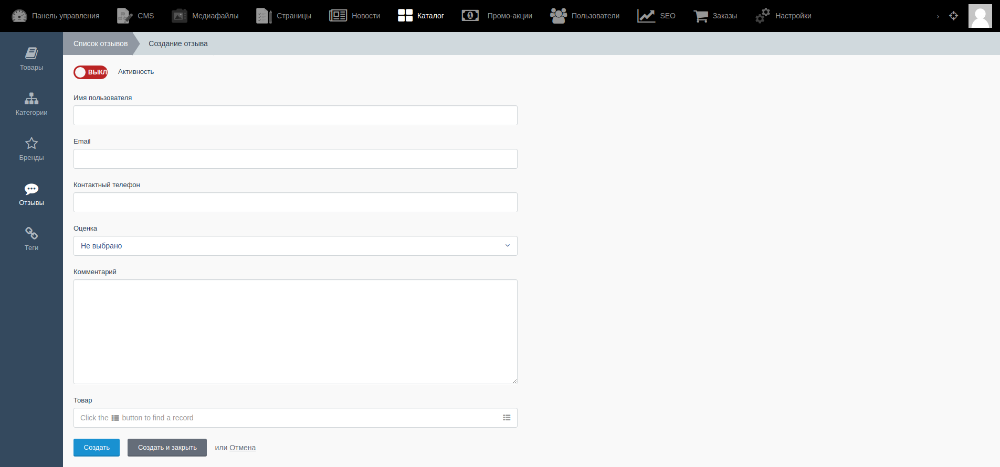
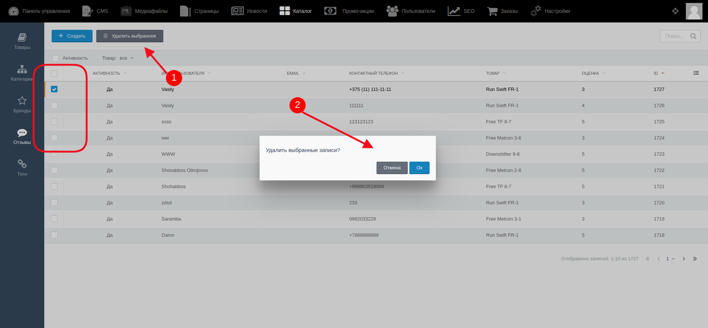
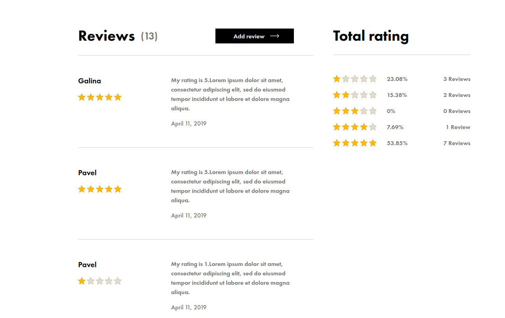

# Управление отзывами о товарах #

Администратор может создавать, редактировать и удалять отзывы о товарах.

Для открытия списка отзывов о товарах необходимо выбрать в верхнем меню раздел "Каталог", а в боковом меню "Отзывы".

Открышаяся страница выглядит так:

Для **создания** нового отзыва необходимо кликнуть на кнопку "Создать". На открывшейся странице администратор заполняет следующие поля:

- Имя пользователя
- Email
- Контактный телефон
- Оценка - из этого списка надо выбрать какую-либо оценку
- Текст самого отзыва
- Поле выбора товара. Здесь товар (к которому прикрепляется отзыв) выбирается из списка вручную или с помощью поиска.

С помощью переключателя Вкл/Выкл администратор регулирует отображение комментария на сайте.

Для **редактирования** отзыва необходимо выбрать из списка уже существующих отзывов один, кликнуть на его название и внести необходимые изменения, затем сохранить их.

Для **удаления** отзыва или нескольких надо выбрать с помощью чек-боксов их, затем нажать на кнопку "Удалить выбранное" и подтвердить действие.

Комментарии на сайте для пользователей выглядят так:

#### **Важно!** После внесения каких-либо изменений их надо сохранить с помощью кнопок:

* Кнопка “Сохранить” - используется после завершения заполнения необходимых полей для сохранения информации и корректном её отображении на сайте. После её нажатия происходит обновление информации, а администратор остается на странице редактирования.

* Кнопка “Сохранить и закрыть” - используется после завершения заполнения необходимых полей для сохранения информации и корректном её отображении на сайте. После её нажатия происходит обновление информации, а администратор автоматически переходит к списку, открывающемуся по умолчанию.