# Управление темой интерфейса

Для настройки основных параметров темы следует в верхнем меню выбрать раздел "Настройки", а затем в левом меню выбрать раздел "CMS" и в нем подраздел "Фронтенд темы". Эти настройки очень важны , так как затрагивают все блоки на главной странице.

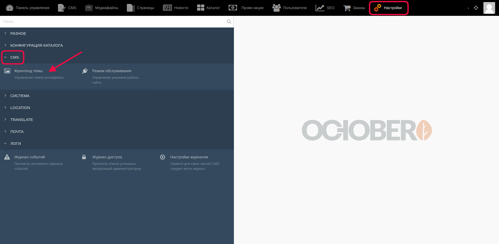

Открывается страница со списком всех имеющихся тем (в данном примере тема одна):

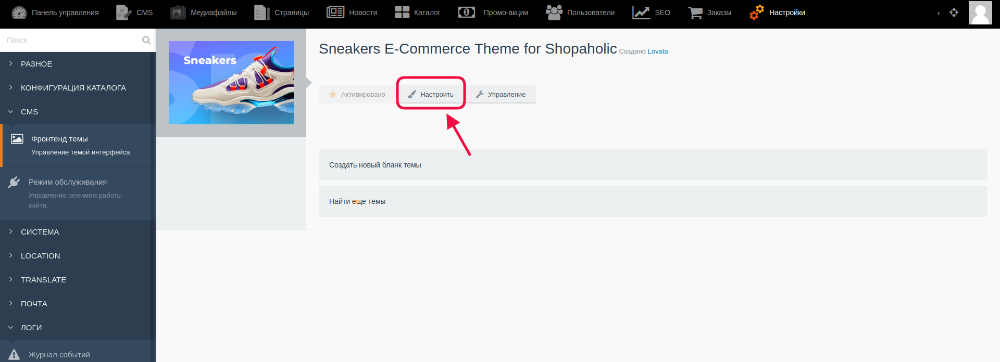

Для изменения настроек надо кликнуть на кнопку "Настроить".

Затем открывается страница, содержащая в себе вкладки с основными настройками. По умолчанию открывается **вкладка "General"** (Общие настройки)

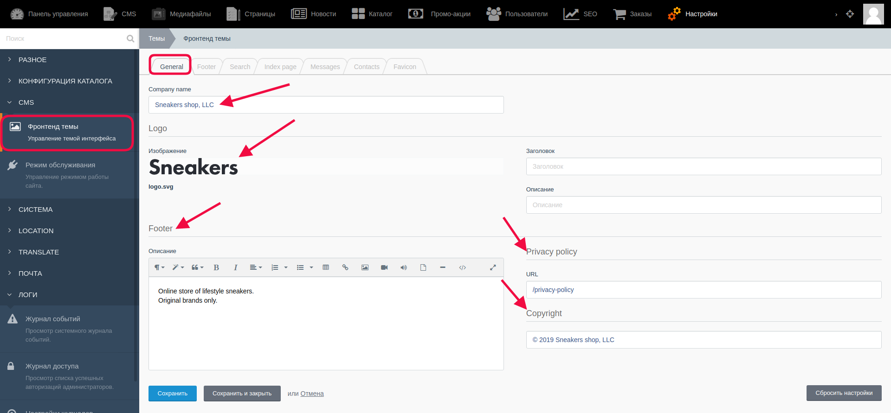

На этой вкладке администратор может внести основное название магазина, загрузить логотип, заполнить поле "Описание" в блоке "Footer" (футер), а также внести ссылку в поле "URL" в блоке "Privacy policy" и заполнить поле "Copyright". На сайте это отобразится в следующим образом:

Поля, заполненные в блоках футера и логотипа:

1 - здесь будет отображаться логотип, если администратор его загрузит;
2 - текст, заполненный администратором в поле "Описание" в блоке "Footer";
3 - при клике на текст "Privacy policy" пользователь перейдет на заданный администратором URL;
4 - текст с информацией, который заполняется в поле "Copyright".

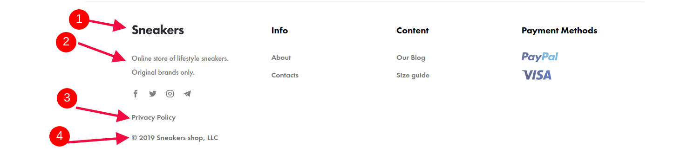

На **вкладке "Footer"** администратор заполняет поля в блоках "Social networks" - ссылки на свои группы в предложенных социальных сетях, и "Payment methods", где в поле "Заголовок" можно внести текст, который будет возникать при наведении курсора на изображения метода оплаты, в поле "Название" вносится соответственно само название, в поле "URL" вносится URL, по котрому пользователь, при клике на изображение метода оплаты, может перейти на тот URL-адрес, который будет задан. Правее этих полей можно загрузить изображение, уменьшенная иконка которого будет находиться в футере. Для увеличения числа способов оплаты надо кликнуть внизу последнего заполненного на "ADD NEW ITEM", и добавится новый шаблон.

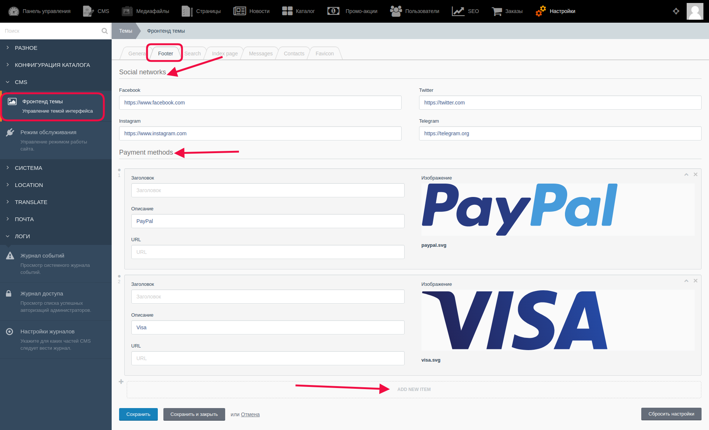

На сайте для пользователя внесенные изменения будут отображаться так:

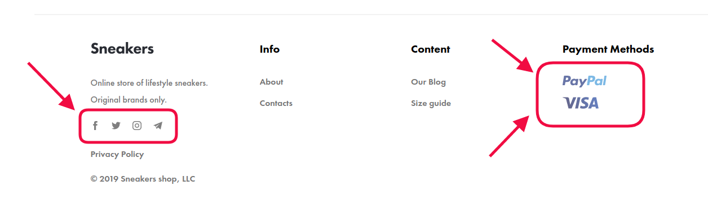

**Вкладка "Search"** - здесь можно выбрать с помощью чек-боксов по каким категориям будет происходить поиск.

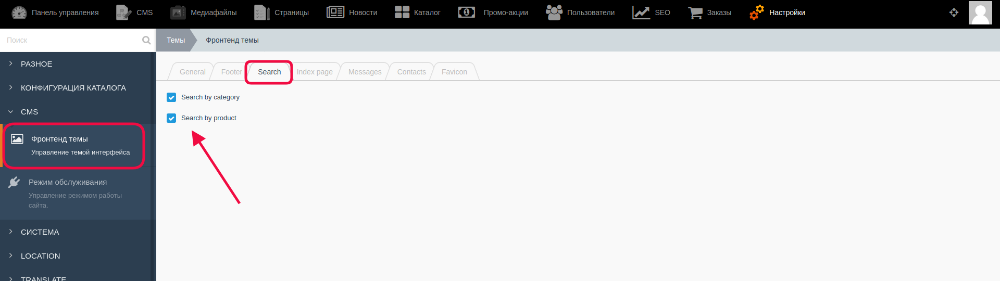

На **вкладке "Index Page"** настраиваются блоки, которые отображаются на главной. 

1) Блок "Main slider" отображается на главной странице под хедэром:

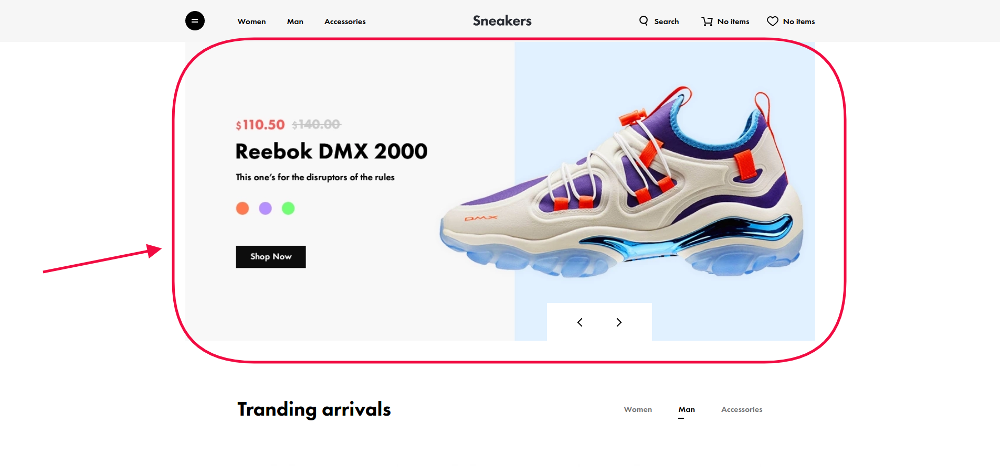

Его поля (и поле для текста, выводящегося в блоке подписки) для заполнения в административной части выглядят так:

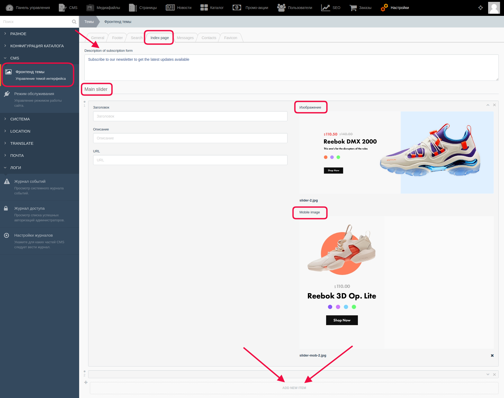

В самом верху есть поле, текст в котором будет отображаться на сайте в блоке "Подписка", например:

Далее располагаются поля для настройки главного слайдера. В слайдере могут находиться один или несколько слайдов с информацией. Если слайдов больше двух, то их можно листать с помощью навигационных стрелок на сайте или же свайпом в мобильной версии/планшете. Также в мобильной версии пользователь может видеть, сколько слайдов находятся в карусели (это обозначено в строке с навигационными стрелками и имеет вид n/m, где n - это номер слайда, который сейчас отображается, а m - общее количество слайдов, которые в карусели)

Поля "Заголовок", "Описание", "URL" заполняются текстовой информацией, например, "Заголовок" будет отображаться возле курсора при наведении на слайд, а при заполненном URL-адресе пользователь перейдет на этот адрес при клике на слайдер. Справа от этих полей администратор может загрузить изображения (а также удалить существующие).

**Важно!** Для мобильной версии изображение загружается отдельно. 

Для добавления ещё одного или нескольких слайдеров после шаблона последнего заполненного слайдера надо кликнуть на "ADD NEW ITEM", и откроется пустой шаблон, готовый к заполнению.

2) Блок "Slider with products" и блок "Slider of banners". Блок "Slider with products" содержит в себе одно поле, куда вносится заголовок, который будет отображаться над группой товаров (это также настраивается). Блок "Slider of banners" заполняется информацией аналогично "Main slider".

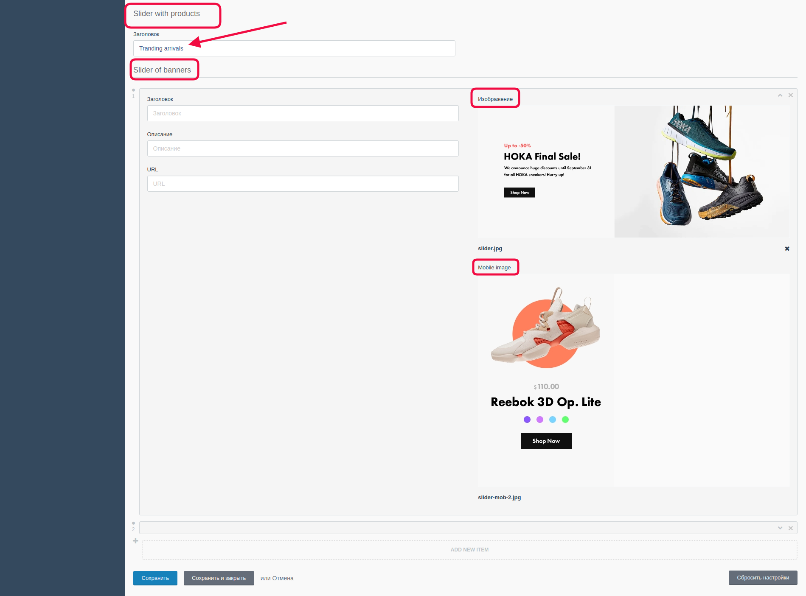

На сайте для пользователя эти блоки выглядят следующим образом: 

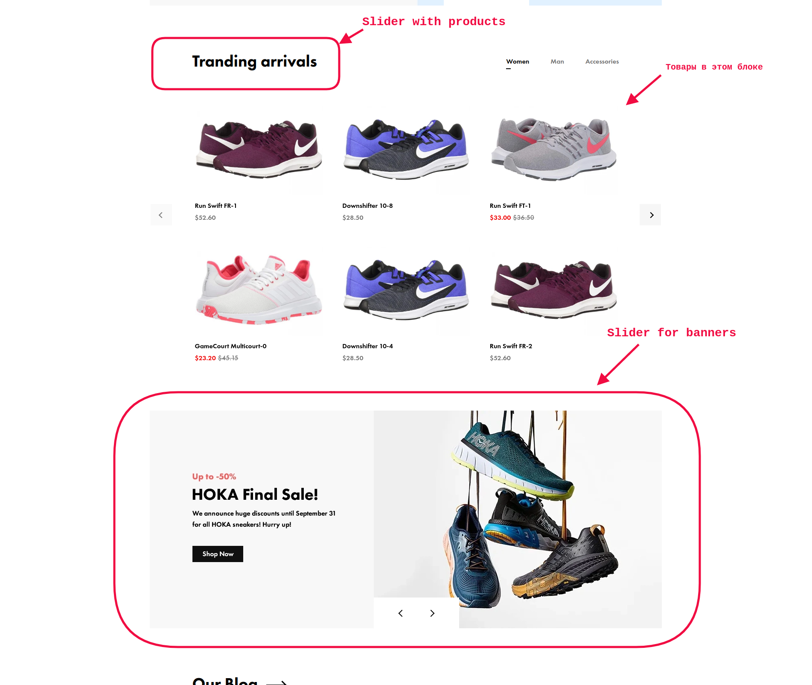

**Вкладка "Contacts"**. Здесь вводится вся необходимая информация, включающая в себя адрес, телефоны и все контактные данные для связи с магазином.

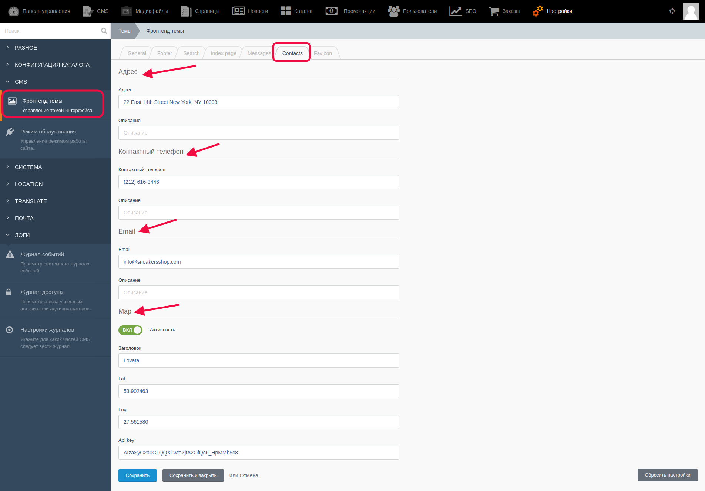

В блоке "Адрес" вводится текстовая контактная информация - адрес, телефон и email для связи. 

В блоке "Map" ("Карта") с помощью переключателя "Активность" администратор выбирает режим отображения карты - "Вкл" - карта показывается пользователю на сайте, и режим "Выкл" убирает карту, и страница контактных данных магазина не содержит карту.

В поля "lat" и "lng" вводится данные и широте и долготе соответственно (это позволит на карте отметить точное расположение магазина), в поле "Название" - соответственно само название магазина, и в поле "API key" ввести ранее полученный API key.

На сайте эта страница с контактными данными (активность карты настроена как "Вкл") отображается так:

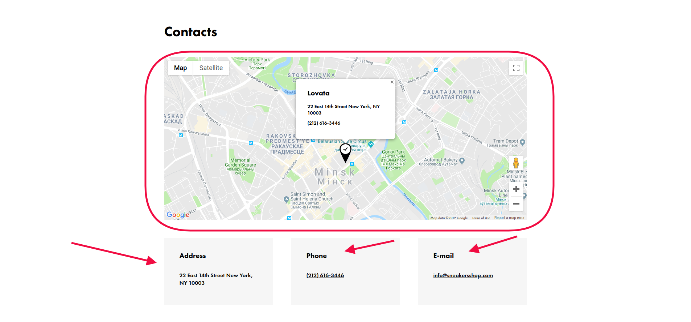

**Вкладка "Messages"** содержит два поля - одно для информации, которая будет выводиться при оформлении заказа при выборе способа доставки (Message for delivery methods), а второе при отправлении после заполнения контактной формы (Message for contact form). То есть, для пользователя при оформлении заказа это отображается так:

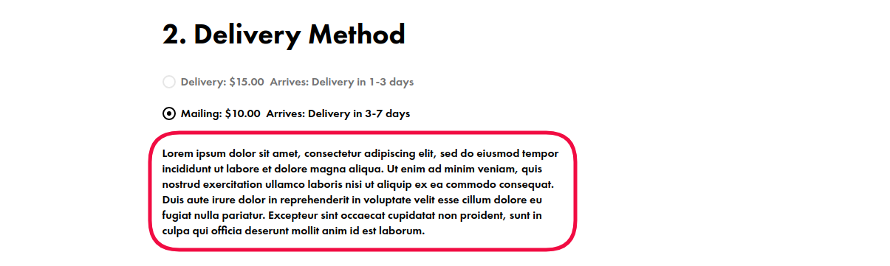

**Вкладка "Favicon"** содержит поля для загрузки икноки магазина различных размеров.

#### **Важно!** После внесения каких-либо изменений их надо сохранить с помощью кнопок:

* Кнопка “Сохранить” - используется после завершения заполнения необходимых полей для сохранения информации и корректном её отображении на сайте. После её нажатия происходит обновление информации, а администратор остается на странице редактирования.

* Кнопка “Сохранить и закрыть” - используется после завершения заполнения необходимых полей для сохранения информации и корректном её отображении на сайте. После её нажатия происходит обновление информации, а администратор автоматически переходит к странице, открывающейся по умолчанию.