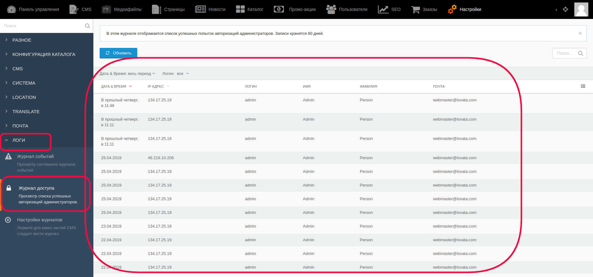

# Журнал доступа

Для просмотра успешных попыток авторизаций администраторов существует журнал логов. Данные в нём хранятся 60 дней.

Для того, чтобы зайти в этот журнал, необходимо перейти в верхнем меню в раздел “Настройки”, затем в левом меню выбрать “Логи” - Журнал доступа”

В открывшемся журнале будут данные о дате авторизации, времени, логине пользователя, его email и т.д.

