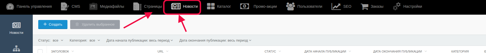
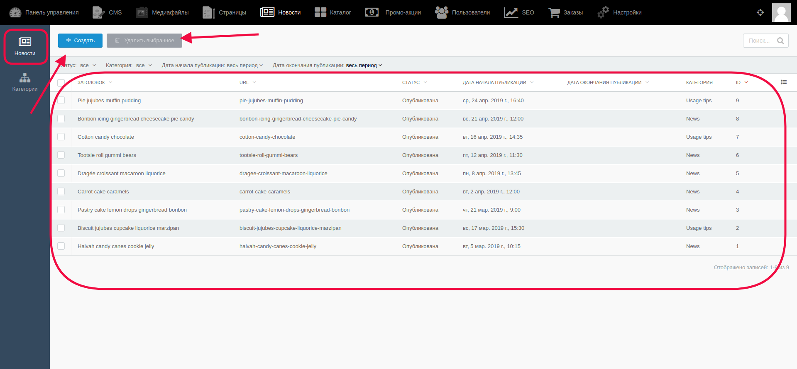
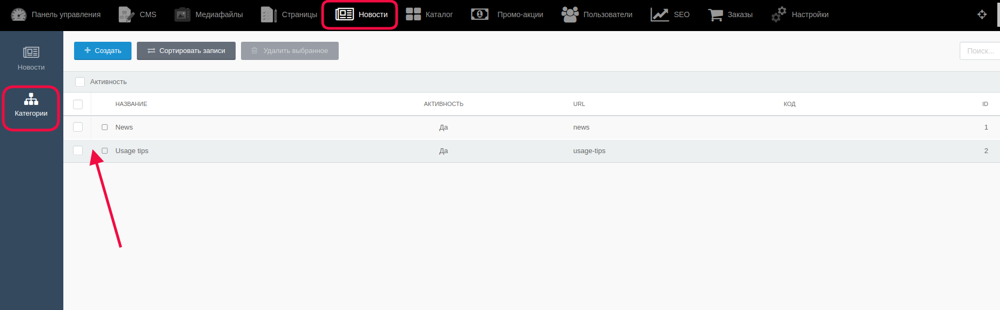
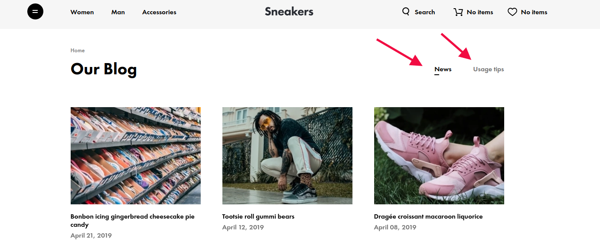
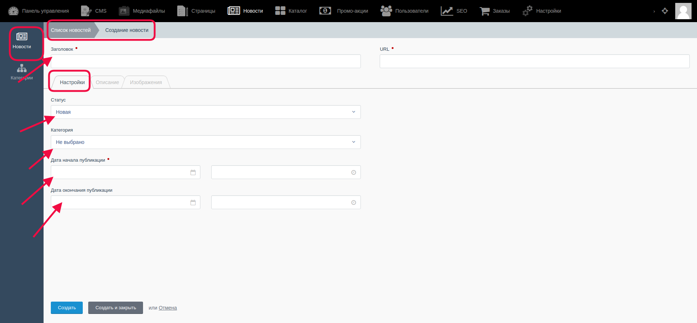
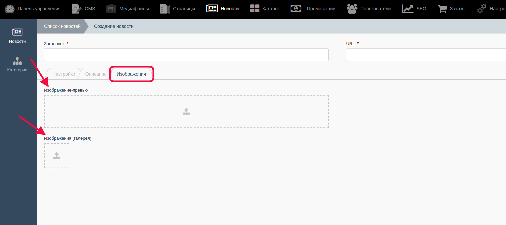
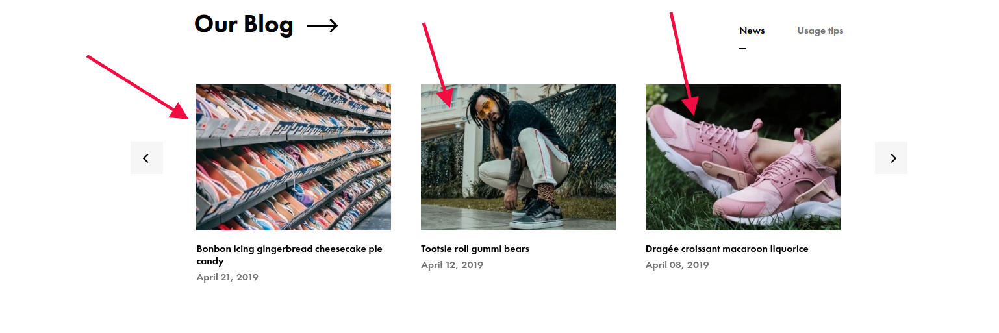
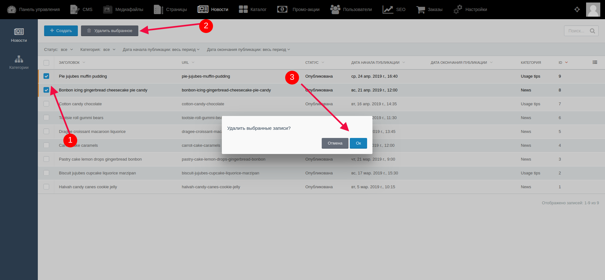

# Управление записями в блоге

Для перехода к списку новостей (записей в блоге) надо выбрать раздел "Новости" в верхнем меню.

Раздел "Новости" состоит из двух подразделов - "Новости" (где находятся сами статьи) и "Категории" (к которым можно прикрепить новости при создании или при редактировании)

### Подраздел "Новости" ###

На открывшейся странице администратор может видеть список ранее созданных новостей, может редактировать, удалять и создавать записи (удаление и содание новых записей производятся с помощью кнопок "Удалить выбранное" и " Создать"). Для редактирования новости необходимо кликнуть на название статьи, и на открывшейся странице произвести необходимые изменения.

### Подраздел "Категории" ###

В этом подразделе администратор может управлять информацией о категориях, к которым он может прикрепить новости, и тогда она будут выводиться и сортироваться на сайте согласно выбранному.

На сайте переключение между категорями новостей может выглядеть следующим образом:

#### Создание новости.

Для создания новости необходимо на общей странице “Новости” кликнуть на кнопку “Создать". Затем открывается новая страница с шаблоном новости.

- **Вкладка “Настройки”**

В этой вкладке определяются основные настройки новости.

- Администратор заполняет поле “Название” - введенный текст будет заголовком новости.

- В списке можно выбрать статус новости - “Новая”, “Опубликована”, “Готовится к выпуску”

- Поля со временем - здесь вводится дата и время начала публикации новости и окончание публикации.

- Администратор выбирает из списка категорию, с которой будет связана новость.

- **Вкладка “Описание”**

Имеет два поля - "Краткое описание" - здесь вводится краткая информация о новости, которая будет отображаться на превью, и "Описание" - в этом поле администратор вводит общую информацию о новости/акции. Он работает с текстом используя уже имеющийся текстовый редактор, может добавлять изображения, изменять шрифты и пр.

- **Вкладка “Изображения”**

Вкладка, в которой можно загрузить изображение, которое будет показываться на превью и в галерее. Для этого надо кликнуть на значок загрузки и загрузить изображение (соответственно на превью и в галерею)

На сайте для пользователя превью изображения выглядит так:

#### Редактирование новости

В списке ранее созданных новостей надо кликнуть на ту, которая нуждается в редактировании.

Открывается страница с содержимым новости. Редактирование происходит в различных вкладках на странице новости.

#### Удаление новости

В списке ранее добавленных новостей с помощью чек-бокса надо выделить одну или несколько новостей, которые надо удалить.

После выбора нажать на кнопку “Удалить выбранное”, затем подтвердить действие.

#### **Важно!** После внесения каких-либо изменений их надо сохранить с помощью кнопок:

* Кнопка “Сохранить” - используется после завершения заполнения необходимых полей для сохранения информации и корректном её отображении на сайте. После её нажатия происходит обновление информации, а администратор остается на странице редактирования.

* Кнопка “Сохранить и закрыть” - используется после завершения заполнения необходимых полей для сохранения информации и корректном её отображении на сайте. После её нажатия происходит обновление информации, а администратор автоматически переходит к списку, открывающемуся по умолчанию.