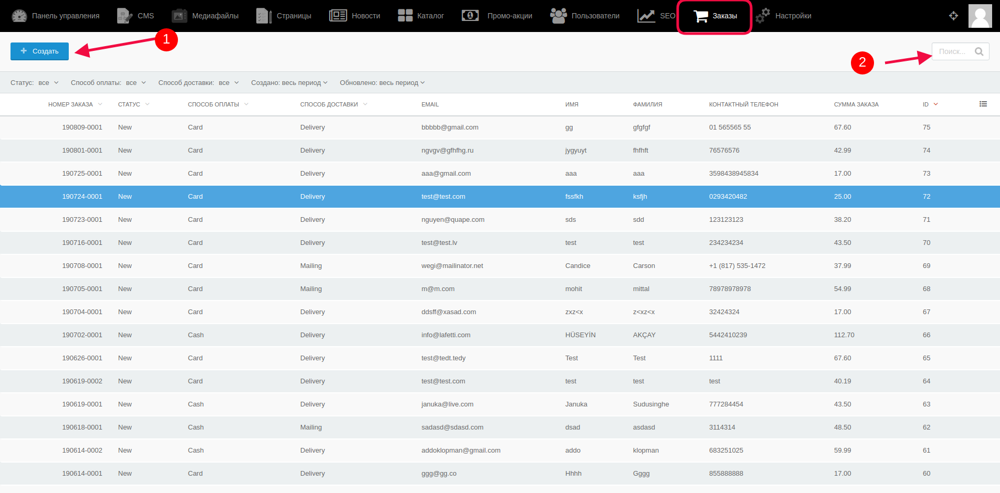
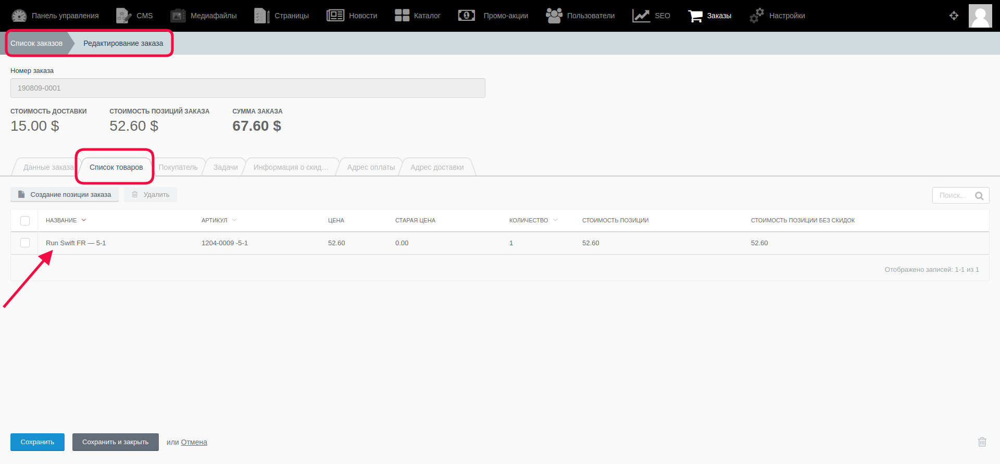
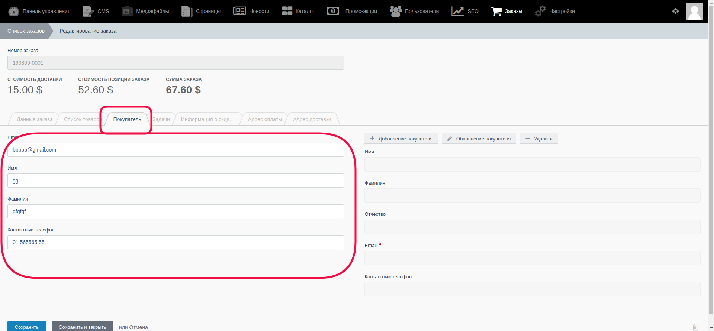
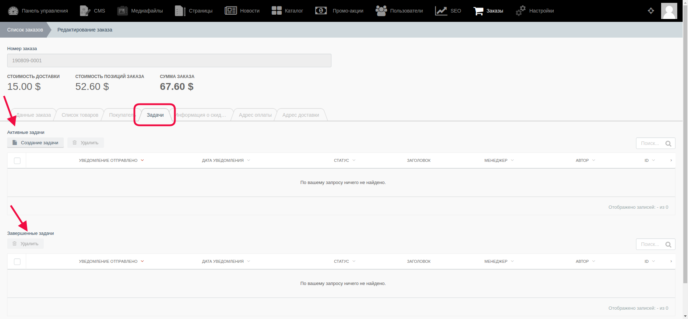
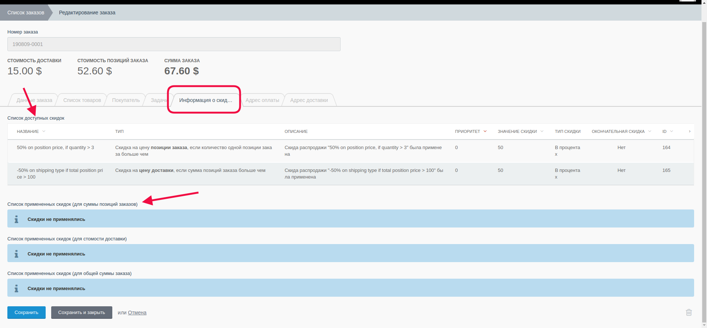
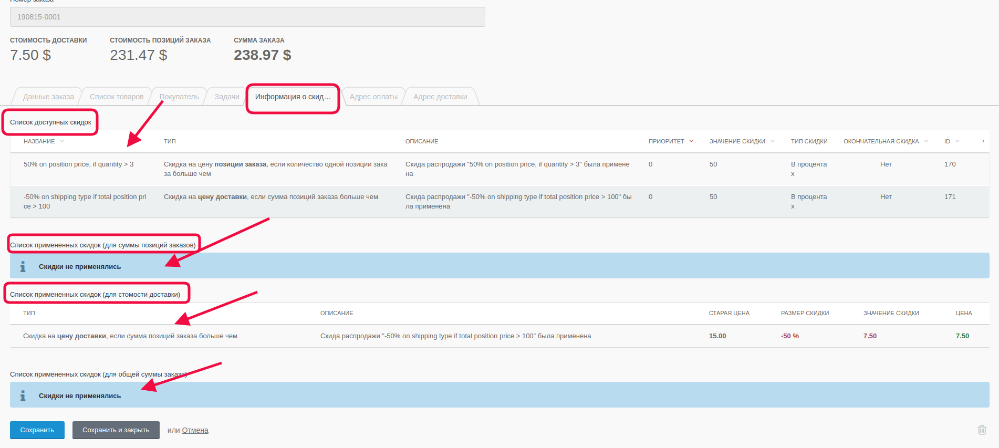

# Управление заказами #

Для перехода к списку ранее совершенных заказов необходимо перейти к разделу "Заказы".

Администратор может создать новый заказ (п.1. на скриншоте), а также просмотреть все существующие - с помощью поля поиска (п.2 на скриншоте) или же пролистывать список вручную.

Также, при клике на название заказа, администратор переходит на страницу с полной инофрмацией о заказе, которую он может редактировать.

**Вкладка "Данные заказа"**. Здесь можно увидеть, из чего формируется общая сумма заказа: показана стоимость доставки (в зависимости от выбора пользователя), стоимость позиций заказа (конкретно то, что заказал пользователь), и общая сумма заказа. Общая стоимость подсчитывается автоматически.

В полях "Способ оплаты", "Способ доставки" указаны те данные, которые выбрал пользователь. В поле "Статус" указывается текущий статус этого заказа; в поле "Стоимость доставки" указывается цена доставки (в зависимости от того, какой способ выбрал покупатель). В поле "Менеджер" по умолчанию стоит "Не выбрано", однако, при наличии созданных профилей "Менеджер", можно выбрать нужный.

**Вкладка "Список товаров"**. Здесь можно просмотреть товары, которые заказал покупатель, а также добавить/удалить один или несколько. 

**Вкладка "Покупатель"** содержит информацию о покупателе, которую он сам заполнил. Её также, при необходимости, можно изменить, а также добавить ещё пользователя, обновить о нём информацию или удалить.

**Вкладка "Задачи"** содержит информацию о созданных, ожидающих отправки, уведомлениях для пользователя, или же уже отправленных. В подразделе "Активные" находятся задачи ещё не завершенные, здесь можно создать ещё одну или несколько, а в подразделе "Завершенные" находят те, которые уже отправлены или срок действия которых уже истек. Также можно выбрать одну или несколько задач и удалить их.

**Вкладка "Информация о скидках"**. Здесь выводится информация о существующих доступных скидках, а также список с примененными/непримененными скидками для этого заказа.

Пример 1: для этого заказа не было применено ни одной скидки:

Пример 2: для этого заказа были применены скидки, но только те, условия которых были выполнены:

**Вкладки "Адрес оплаты" и "Адрес доставки"** содержат в себе информацию об адресе, необходимом для доставки и оплаты.

#### **Важно!** После внесения каких-либо изменений их надо сохранить с помощью кнопок:

* Кнопка “Сохранить” - используется после завершения заполнения необходимых полей для сохранения информации и корректном её отображении на сайте. После её нажатия происходит обновление информации, а администратор остается на странице редактирования.

* Кнопка “Сохранить и закрыть” - используется после завершения заполнения необходимых полей для сохранения информации и корректном её отображении на сайте. После её нажатия происходит обновление информации, а администратор автоматически переходит к списку, открывающемуся по умолчанию.
