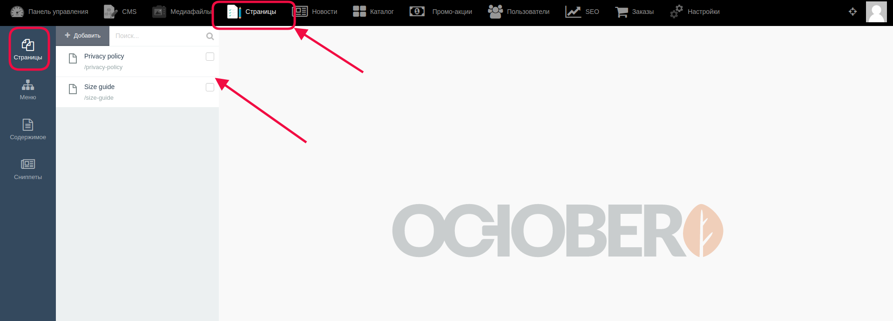
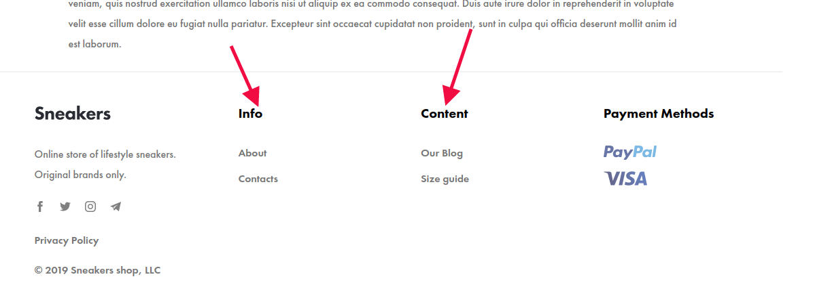
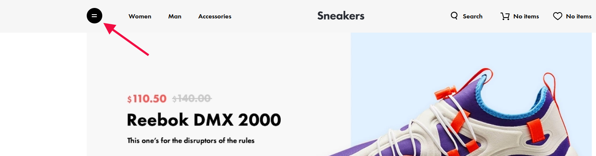
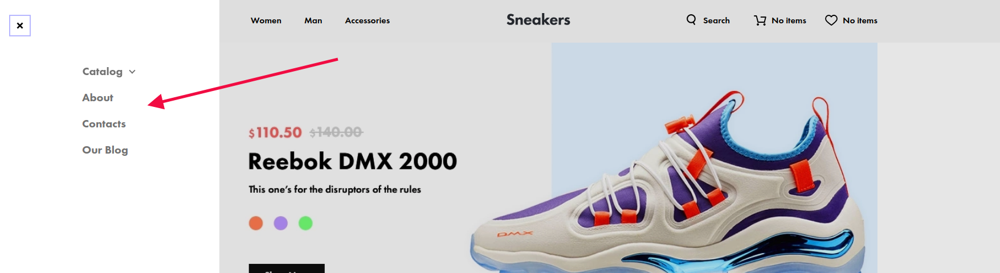
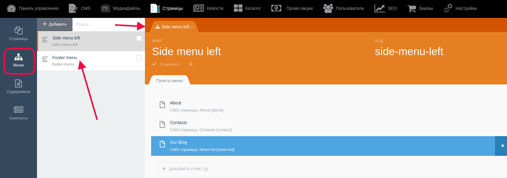

# Работа с разделом "Страницы"

Для перехода к данному разделу надо выбрать в меню сверху раздел "Страницы", затем в меню слева выбрать одноименный подраздел. Откроется список созданных страниц.

* #### Подраздел "Страницы" ####

Для создания новой страницы надо нажать на кнопку "Создать", для удаления уже существующей или нескольких - отметить их в списке с помощью галочки в чек-боксах, а затем нажать на изображение корзины (появляется вверху, рядом с кнопкой "Создать")

Для редактирования страницы необходимо кликнуть на нее, и в открывшемся справа от списка окне внести изменения.

На сайте заголовки, ведущие к этим страницам, находятся: 

- в футере:

- в боковом меню (для открытия бокового меню надо кликнуть на "гамбургер" в верхней левой части сайта)

* #### Подраздел "Меню" ####

Для перехода сюда надо выбрать в левом меню подраздел "Меню".

Здесь можно видеть список с созданными разделами на сайте, куда в дальнейшем прикрепляются страницы. На примере это Side menu left (Боковое меню слева) и Footer menu (Меню футера).

После проведенных изменений для корректного отображения на сайте их необходимо сохранить. 