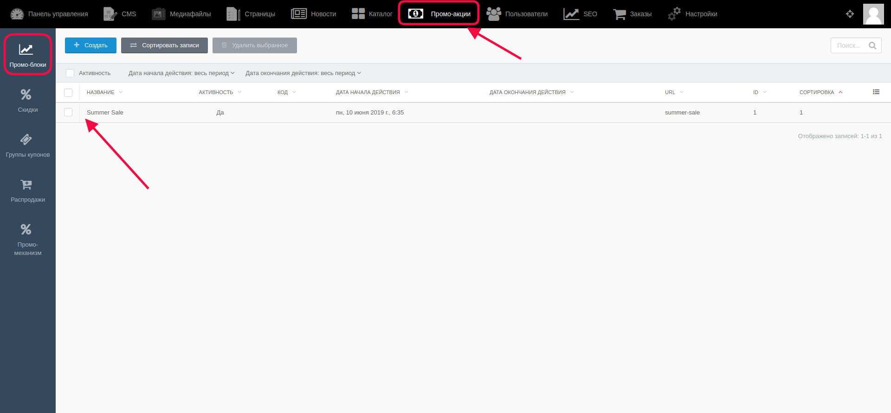
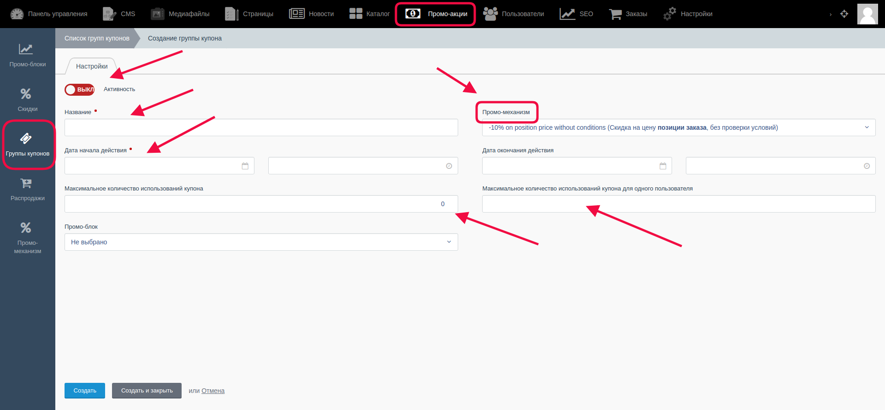
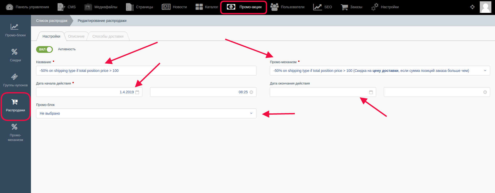
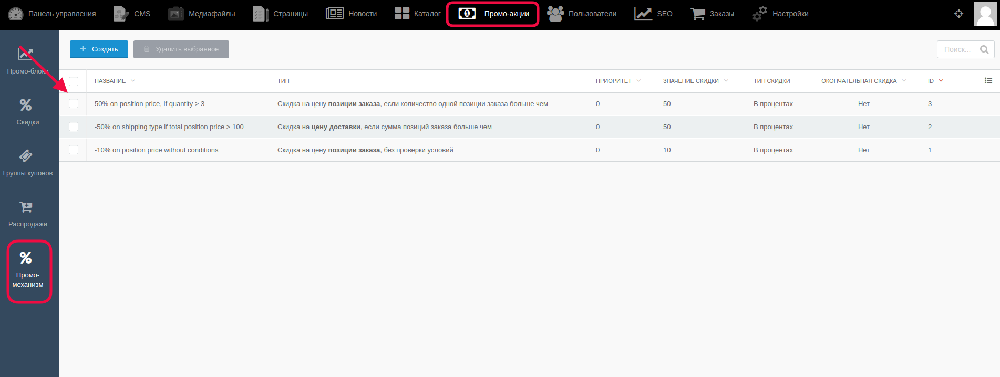
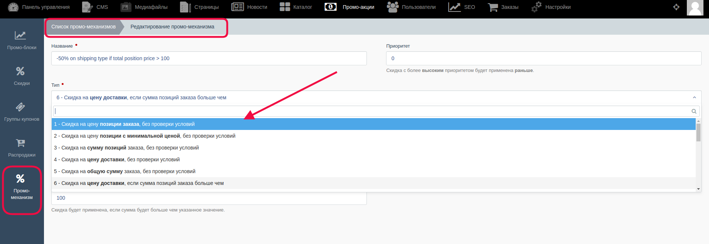

# Блок промо-акций

В этом блоке администратор управляет различными промо-акциями, скидками, купонами, распродажами и пр.

Для перехода необходимо в верхнем меню выбрать раздел "Промо-акции"

По умолчанию первой открывается **подраздел "Промо-акции"**, и становится доступным список всех ранее созданных промоакций. Также здесь можно создать одну или несколько промо-акций (с помощью кнопки "Создать"), удалить выбранные, или отредактировать их. Для редактирования нужно кликнуть на название акции и в открывшейся странице произвести изменения.

**Подраздел "Скидки"** в левом меню содержит в себе всю информацию о ранее созданных скидках, с возможностью создавать новые, редактировать/удалять уже существующие.

**Подраздел "Группа купонов"**. Купоны необходимы для создания скидки при оформлении заказа. Пользователь, который имеет данный купон, вводит его в специальное поле при оформлении заказа и получает измененную сумму к оплате.

Администратор создает один купон или несколько, находясь в этом подразделе (перейти на него можно выбрав "Промо-акции" в верхнем меню, а затем, в левом меню выбрать "Группа купонов") и кликнув на кнопку "Создать". На странице создания купона надо заполнить все необходимые поля и сохранить изменения. Существующие купоны администратор может привязывать к товарам. 

**Подраздел "Распродажи"** содержит в себе список созданных ранее распродаж. Как и в других подразделах, администратор может создавать, удалять, и редактировать тут пункты. 

На странице самой распродажи вводится/выбирается следующее:

- Название распродажи

- В поле "Промо-механизм" выбирается механизм из списка ранее созданных 

- В поля начала и окончания времени распродажи администратор вносит период, когда распродажа будет действовать.

- Также распродажу можно связать с промо-блоком (при условии его существования), выбрать необходимый в поле "Промо-блок" 

**Подраздел "Промо-механизм"**. Это раздел, в котором содержится информация о специальных промо-механизмах, которые срабатывают при определенных условиях заказа товаров покупателем. Их также можно редактировать, создавать и удалять.

При создании или редактирования весьма важным параметром является тип, т.к. в зависимости от выбранного будет происходить изменение окончательной стоимости заказа для покупателя:

 

#### **Важно!** После внесения каких-либо изменений их надо сохранить с помощью кнопок:

* Кнопка “Сохранить” - используется после завершения заполнения необходимых полей для сохранения информации и корректном её отображении на сайте. После её нажатия происходит обновление информации, а администратор остается на странице редактирования.

* Кнопка “Сохранить и закрыть” - используется после завершения заполнения необходимых полей для сохранения информации и корректном её отображении на сайте. После её нажатия происходит обновление информации, а администратор автоматически переходит к списку, открывающемуся по умолчанию.
