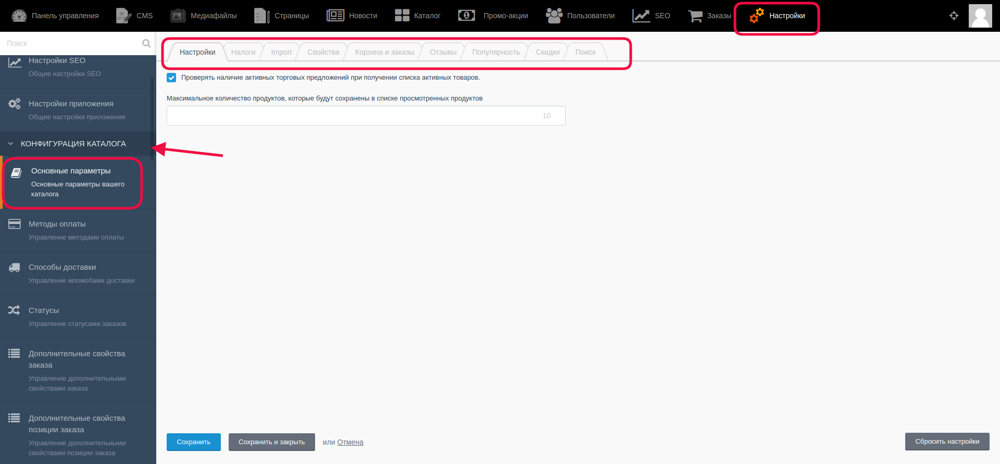
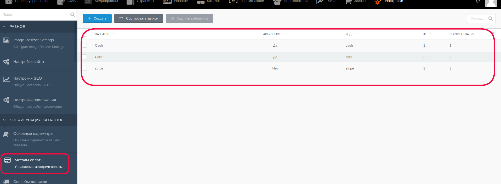
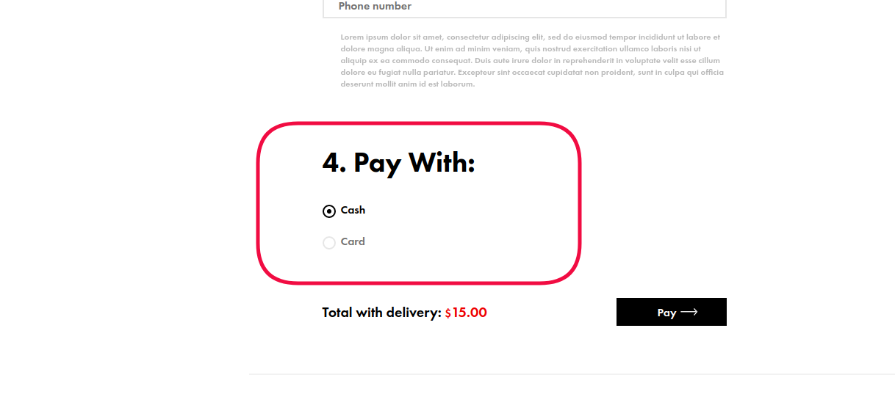
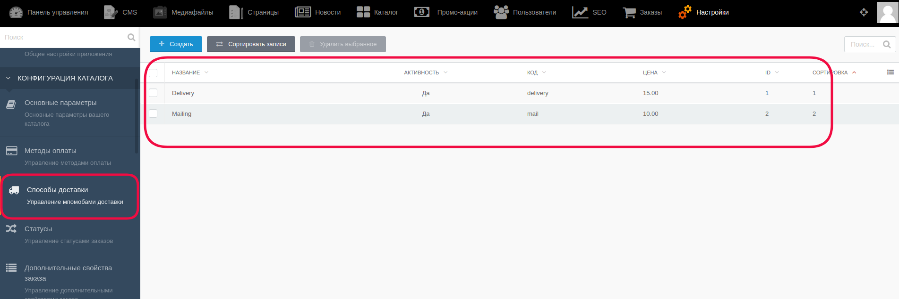
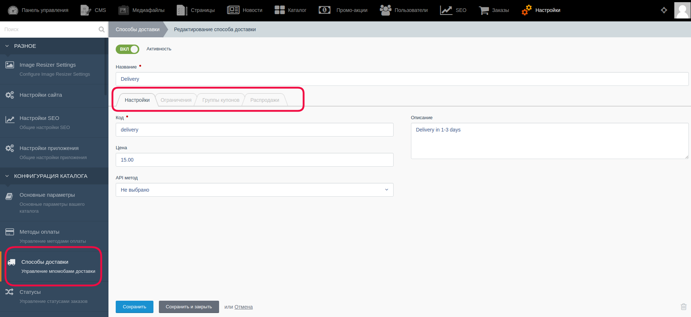
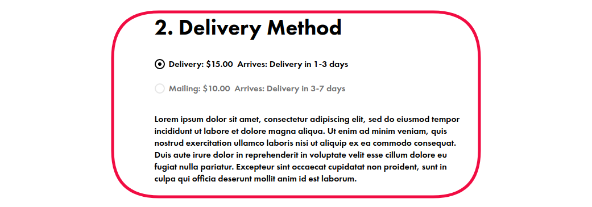
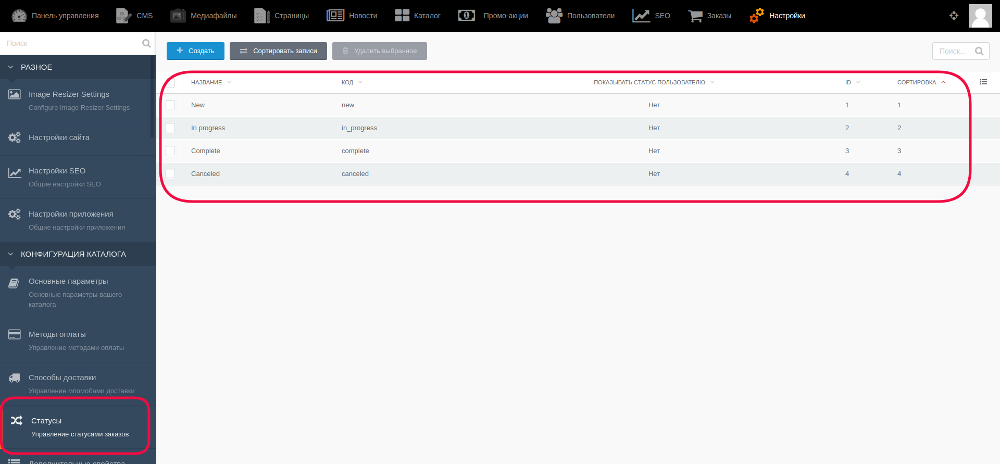

# Конфигурация каталога.

В верхнем меню выбрать “Настройки”

На открывшейся странице настроек в левой части выбрать “Конфигурация каталога”

Далее будут описаны основные подразделы.

**Подраздел "Основные параметры"** имеет вкладки для настройки основных параметров каталога.

**Подраздел "Методы оплаты"** позволяет управлять ранее созданными методами оплаты, а также создавать и добавлять новые, менять их статус отображения для покупателя (переключатель активности "Вкл/Выкл")

В зависимости от количества методов оплаты для пользователя при заказе товаров будет виден следующий список, из которого он может выбрать только один вариант оплаты:

**Подраздел "Способы доставки"** позволяет управлять ранее созданными способами доставки, а также создавать и добавлять новые, менять их статус отображения для покупателя (переключатель активности "Вкл/Выкл")

Для того, чтобы зайти на страницу одного способа доставки и изменить в нём информацию, необходимо кликнуть по названию и на открывшейся странице произвести нужные изменения.

В настройках способов доставки можно изменить такую информацию как собственно само название доставки, её стоимость (которая будет суммироваться в дальнейшем для получения общей стоимости заказа для покупателя), описание способа доставки - для подробной информации. При помощи переключателя активности "Вкл/Выкл" администратор может регулировать показ способа доставки для пользователя. 

При оформлении заказа покупатель может выбрать один из нескольких предложенных (количество в списке для выбора зависит от настройки в этом подразделе) способов доставки:

**Подраздел "Статусы"** содержит в себе список статусов, которые можно привязывать к заказам для их упорядочивания, например, в списке заказов можно будет отфильтровать по статусу - "New", "In Progress" и т.д.

Администратор может создавать новые статусы, редактировать и удалять уже имеющиеся.

#### **Важно!** После внесения каких-либо изменений их надо сохранить с помощью кнопок:

* Кнопка “Сохранить” - используется после завершения заполнения необходимых полей для сохранения информации и корректном её отображении на сайте. После её нажатия происходит обновление информации, а администратор остается на странице редактирования.

* Кнопка “Сохранить и закрыть” - используется после завершения заполнения необходимых полей для сохранения информации и корректном её отображении на сайте. После её нажатия происходит обновление информации, а администратор автоматически переходит к списку, открывающемуся по умолчанию.